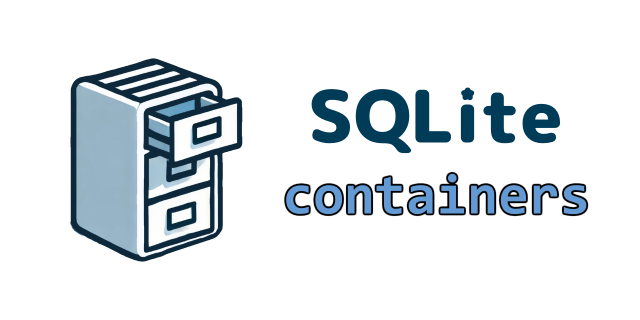

# SQLite Containers


**SQLite Containers** is a lightweight header-only C++ library designed to provide seamless integration between SQLite databases and standard C++ containers, such as std::map and other associative containers. This library abstracts the complexity of database operations, allowing developers to interact with SQLite databases using familiar container interfaces. It ensures data persistence while providing robust mechanisms for synchronization between in-memory data structures and persistent storage.

## Features

- **Container Integration:** Supports synchronization of SQLite databases with various standard C++ containers, including `std::map` and other associative containers.
- **Easy-to-Use API:** Simplified API for common operations like `insert`, `remove`, `find`, `sync`, and `clear`.
- **Multiple Classes, Single Database**: Supports multiple class instances working with different data types, all connecting to the same SQLite database file.
- **Transaction Management:** Provides transaction support to ensure data integrity during complex operations.
- **Customizable Configuration:** Allows configuration of database paths, table names, and other settings.
- **Thread-Safety:** Built-in mechanisms to ensure thread-safe interactions with the database.
- **Exception Handling:** Exception handling to manage SQLite errors gracefully.
- **C++17 Compatible**: Fully supports `C++17` and its advanced features, ensuring modern C++ development practices.

## Classes

### KeyDB

The `KeyDB` class is designed for storing unique keys and allows working with containers like `std::set`, `std::unordered_set`, `std::list`, and `std::vector`.

### KeyValueDB

The `KeyValueDB` class stores key-value pairs and allows working with `std::map` and `std::unordered_map`.

### KeyMultiValueDB

The `KeyMultiValueDB` class is designed for managing key-value pairs in a SQLite database, where each key can map to multiple values. The database follows a many-to-many relationship model. This class allows flexibility in how keys and values are stored and supports operations with containers such as `std::multimap`, `std::unordered_multimap`, or containers where keys map to collections of values, like `std::map<KeyT, std::vector<ValueT>>`.

## Installation

To use the SQLite Containers library, simply include the source files in your project and ensure that you have the SQLite3 library installed. The library is compatible with `C++17`.

Make sure SQLite is compiled with the `SQLITE_THREADSAFE=1` option to provide multithreading support.

## Usage Example

Here’s a basic example demonstrating how to use multiple instances of `KeyDB`, `KeyValueDB`, and `KeyMultiValueDB` connected to the same SQLite database file but operating on different tables and data types:

```cpp
#include <sqlite_containers/KeyDB.hpp>
#include <sqlite_containers/KeyValueDB.hpp>
#include <sqlite_containers/KeyMultiValueDB.hpp>
#include <iostream>
#include <set>
#include <map>
#include <vector>

int main() {
    try {
        // Config for the first database with integer keys (KeyDB)
        sqlite_containers::Config config1;
        config1.db_path = "example_multi_type.db";
        config1.table_name = "integer_keys";
        sqlite_containers::KeyDB<int> key_db(config1);
        key_db.connect();

        // Config for the second database with string keys and double values (KeyValueDB)
        sqlite_containers::Config config2;
        config2.db_path = "example_multi_type.db";
        config2.table_name = "string_to_double";
        sqlite_containers::KeyValueDB<std::string, double> kv_db(config2);
        kv_db.connect();

        // Config for the third database with float keys and std::string values (KeyValueDB)
        sqlite_containers::Config config3;
        config3.db_path = "example_multi_type.db";
        config3.table_name = "float_to_string";
        sqlite_containers::KeyValueDB<float, std::string> kv_db2(config3);
        kv_db2.connect();

        // Config for the fourth database with int keys and multiple string values (KeyMultiValueDB)
        sqlite_containers::Config config4;
        config4.db_path = "example_multi_type.db";
        config4.table_name = "int_to_multi_strings";
        sqlite_containers::KeyMultiValueDB<int, std::string> kmv_db(config4);
        kmv_db.connect();

        // Clear tables for a fresh start
        key_db.clear();
        kv_db.clear();
        kv_db2.clear();
        kmv_db.clear();

        // Insert data into KeyDB
        std::set<int> int_keys = {1, 2, 3, 4};
        key_db.append(int_keys);

        // Insert data into the first KeyValueDB (string to double)
        kv_db.insert("apple", 1.1);
        kv_db.insert("banana", 2.2);
        kv_db.insert("orange", 3.3);

        // Insert data into the second KeyValueDB (float to string)
        kv_db2.insert(1.5f, "one point five");
        kv_db2.insert(2.7f, "two point seven");

        // Insert data into KeyMultiValueDB (int to multiple strings)
        kmv_db.insert(1, "value1");
        kmv_db.insert(1, "value2");
        kmv_db.insert(2, "valueA");
        kmv_db.insert(2, "valueB");

        // Retrieve and print data from KeyDB
        std::set<int> retrieved_int_keys = key_db.retrieve_all<std::set>();
        std::cout << "Keys in KeyDB: ";
        for (const auto& key : retrieved_int_keys) {
            std::cout << key << " ";
        }
        std::cout << std::endl;

        // Retrieve and print data from the first KeyValueDB
        std::map<std::string, double> string_to_double = kv_db.retrieve_all<std::map>();
        std::cout << "String-to-Double KeyValueDB contents:" << std::endl;
        for (const auto& pair : string_to_double) {
            std::cout << "Key: " << pair.first << ", Value: " << pair.second << std::endl;
        }

        // Retrieve and print data from the second KeyValueDB
        std::map<float, std::string> float_to_string = kv_db2.retrieve_all<std::map>();
        std::cout << "Float-to-String KeyValueDB contents:" << std::endl;
        for (const auto& pair : float_to_string) {
            std::cout << "Key: " << pair.first << ", Value: " << pair.second << std::endl;
        }

        // Retrieve and print data from KeyMultiValueDB
        std::multimap<int, std::string> int_to_multi_strings = kmv_db.retrieve_all<std::multimap>();
        std::cout << "Int-to-MultiStrings KeyMultiValueDB contents:" << std::endl;
        for (const auto& pair : int_to_multi_strings) {
            std::cout << "Key: " << pair.first << ", Value: " << pair.second << std::endl;
        }

    } catch (const sqlite_containers::sqlite_exception& e) {
        std::cerr << "SQLite error: " << e.what() << std::endl;
    } catch (const std::exception& e) {
        std::cerr << "Error: " << e.what() << std::endl;
    }
    return 0;
}
```

This example shows how you can have multiple database tables, each working with different types of data, all in the same SQLite file.

Several example use cases are provided in the [examples](https://github.com/NewYaroslav/sqlite-containers/tree/main/examples) folder of the repository.

## Documentation

Detailed documentation for **SQLite Containers** can be found [here](https://newyaroslav.github.io/sqlite-containers/).

## License

This project is licensed under the [MIT License](LICENSE).
